# drift_orchestrator



**LLM safety-monitor security research platform.** Built to detect policy drift in LLM sessions — and to test how those detection architectures fail under adversarial input.

[](https://github.com/GnomeMan4201/drift_orchestrator/actions)


---

## Live demos

| Demo | Description |
|------|-------------|
| [Research Portal](https://gnomeman4201.github.io/drift_orchestrator/) | Full findings, interactive vectors, attack chain, data |
| [Dual Signal Governor](https://gnomeman4201.github.io/drift_orchestrator/governor.html) | Interactive architecture — run simulated sessions live |

---

## What this is

drift_orchestrator started as a drift-detection tool and became a security research program. It implements a multi-signal LLM session monitor and uses that monitor as an experimental platform to find, characterize, and document vulnerabilities in LLM safety architectures.

The repository contains the probe implementations, committed experiment outputs, consolidated findings, threat model, research log, long-form writeups, and a public Ollama-compatible HTTP adapter for fresh experiment reruns.

## Reproducibility boundary

The **public evidence package is self-contained for inspection and automated repository verification**: the committed scripts, results, analysis material, adapter, and tests are available here.

Fresh model-experiment reruns no longer require the private sibling `localai_gateway` repository. [`gateway_adapter.py`](gateway_adapter.py) implements the `/route` and `/health` contract expected by the historical probe scripts and can be run as three local instances against Ollama. [`REPLICATE.md`](REPLICATE.md) contains the exact launch commands.

The recorded experiments were originally produced with the historical private gateway implementation. The public adapter is contract-compatible, not a claim that a new run is byte-for-byte identical to the historical runtime. Model versions, Ollama versions, sampling behavior, hardware, and other runtime differences can change results.

Do not treat a green CI run as an independent replication of the model experiments.

---

## Published research

### [Second-Order Injection: Attacking the Evaluator in LLM Safety Monitors](https://dev.to/gnomeman4201/second-order-injection-attacking-the-evaluator-in-llm-safety-monitors-1jnh)
In the recorded experiment set, six injection vectors were characterized across three local model families. The V4 reasoning-capture vector produced 100% bypass in the tested qwen2.5:3b, mistral, and phi3:mini runs and transferred without modification across those tested models. These results establish behavior in the recorded environment; they are not a claim of universal behavior across arbitrary models, versions, prompts, or safety architectures.

### [The Dual-Signal Governor: A Control Plane Pattern for Drift-Aware Systems](https://dev.to/gnomeman4201)
Architecture for combining geometric drift signals with LLM coherence evaluation. Documents the false-positive reduction mechanism and introduces the policy-boost system, with empirical data from the recorded test environment.

### [Semantic Gradient Evasion (SGE): Bypassing Embedding-Based Drift Detectors](https://dev.to/gnomeman4201)
Explores monotonic semantic-gradient chains: small consistent shifts that remain below configured per-step thresholds while producing substantial cumulative semantic movement.

---

## Architecture

```text
Signal A: geometric drift (sentence-transformers embeddings)
Signal B: LLM coherence evaluator (qwen/mistral/phi3 via Ollama)
Governor: dual-signal arbitration with policy boost
Gateway contract: local HTTP inference/control endpoints
Telemetry: SQLite session logging in the historical gateway path
```

---

## Key recorded findings

**V4 transferred across all three tested model families.** In the committed experiment set, the V4 reasoning-capture vector reached 100% bypass for qwen2.5:3b, mistral, and phi3:mini without per-model modification.

**Coupled evaluators showed divergence collapse under the tested symmetric-injection condition.** Recorded inter-system divergence dropped to approximately 0.01 in that experiment, removing the signal the tested governor expected to use.

**The tested sanitization strategies did not fully mitigate V4.** The M4 combination eliminated the earlier V1/V2/V3 behavior in the relevant recorded tests, while V4 survived the tested filtering path.

**Cross-model transfer occurred in the recorded environment.** This is evidence for transfer among the tested models and configurations, not a universal exploit claim.

---

## Experimental data

| File | Contents |
|------|----------|
| `results/soi_phase1.jsonl` | Individual model injection vulnerability |
| `results/soi_phase2.jsonl` | Coupled system bypass |
| `results/mitigation_probe.jsonl` | Sanitization effectiveness |
| `results/cross_model_generalization.jsonl` | phi3:mini generalization |
| `results/phi3_targeted_injection.jsonl` | phi3 targeted vectors |
| `results/vector_transfer.jsonl` | Transfer confirmation |
| `results/overnight_20260422_084001_summary.json` | 3-iteration overnight run |

---

## Probe scripts

| Script | Purpose |
|--------|---------|
| `scripts/second_order_injection_phase1.py` | Individual model injection characterization |
| `scripts/second_order_injection_phase2.py` | Coupled system bypass |
| `scripts/mitigation_probe.py` | Sanitization strategy testing |
| `scripts/cross_model_generalization_probe.py` | Multi-model generalization |
| `scripts/phi3_targeted_injection_probe.py` | phi3-specific vector tuning |
| `scripts/vector_transfer_probe.py` | Cross-model transfer testing |
| `scripts/divergence_threshold_calibration.py` | Detection threshold analysis |
| `overnight_runner.py` | Full multi-iteration orchestration |

---

## Verify the public checkout

```bash
git clone https://github.com/GnomeMan4201/drift_orchestrator.git
cd drift_orchestrator
python3 -m venv .venv
source .venv/bin/activate
python -m pip install --upgrade pip
python -m pip install -r requirements.txt
python -m pytest -q
```

The test suite includes an offline contract check for the public gateway adapter. It does not contact Ollama or claim to reproduce model outputs.

For fresh model-experiment reruns, follow [`REPLICATE.md`](REPLICATE.md).

---

## Research roadmap

- [x] SGE — semantic gradient evasion of embedding detectors
- [x] Dual-signal governor — false positive reduction architecture
- [x] Coupled dual-system — divergence as detection signal
- [x] Second-order injection — evaluator override in the tested architecture
- [x] Cross-model generalization — phi3 resistance and tuned bypass
- [x] Vector transfer — transfer across the tested model set
- [x] Public gateway adapter — self-contained fresh rerun path
- [ ] Adaptive injection — feedback-loop attack
- [ ] Evaluator isolation — architectural defense design
- [ ] Formal model — mathematical characterization of injectability

---

## Reference docs

| Document | Contents |
|----------|----------|
| [FINDINGS.md](FINDINGS.md) | Empirical results and recorded model/vector outcomes |
| [THREAT_MODEL.md](THREAT_MODEL.md) | Attacker profile, attack surface, defender assumptions |
| [REPLICATE.md](REPLICATE.md) | Public verification and fresh-rerun instructions |
| [RESEARCH_LOG.md](RESEARCH_LOG.md) | Chronological record of runs, findings, and dead ends |
| [CHANGELOG.md](CHANGELOG.md) | Material research changes |
| [papers/second_order_injection.md](papers/second_order_injection.md) | Long-form research paper |

---

*Independent security research. Necessity-driven development. badBANANA // gnomeman4201*
